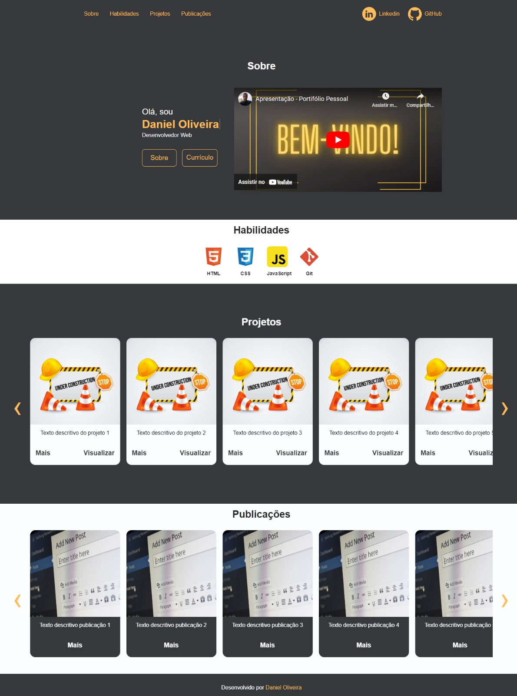

# **Portfólio Pessoal**

## 📝 **Descrição**

Meu portfólio pessoal. Aqui eu me apresento como pessoa Desenvolvedora Web, meus projetos e publicações, além de mostrar um pouco dos conhecimentso que tenho adquirido.

  Captura de Tela

## 📂 **Acesso ao projeto**

Através desses links você terá acesso a [página web](https://danoliveiradev.github.io/portfolio-pessoal/) e acesso aos [arquivos do projeto](https://github.com/danoliveiradev/portfolio-pessoal).

## 🛠 **Técnicas, tecnologias e bibliotecas utilizadas**

`HTML`
`CSS`
`JavaScript`
  
## 🤓 **Desenvolvedores**

| [ Daniel Oliveira](https://github.com/danoliveiradev) |
| :---: |

## 🔐 **Licença**

Este projeto está licenciado nos termos da [licença MIT](https://github.com/danoliveiradev/readme/blob/c1be2c0daacda0a944d2596ea78fbe98d37d0680/LICENSE.txt).

